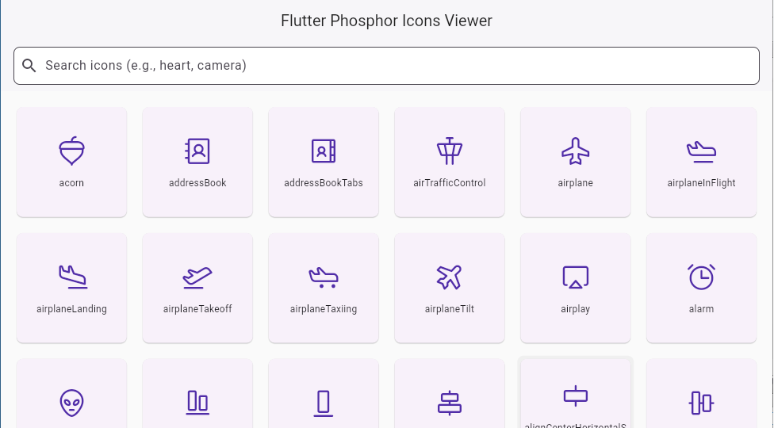

**Phosphor Icons Viewer**

A simple, fast, and searchable web application to explore all icons from Flutter's phosphor_flutter package. This tool was created to provide an easy-to-use visual reference, which was previously unavailable.

Live Demo: [https://sympleaichat.github.io/FlutterPhosphorIconsViewer/](https://sympleaichat.github.io/FlutterPhosphorIconsViewer/)

(Note: Replace the URL above with your actual deployment URL after hosting it on GitHub Pages or another service.)

  

✨ **Features**

•	Instant Search: Quickly find the icons you need with a responsive search bar that filters results as you type.

•	Infinite Scrolling: Icons are loaded efficiently as you scroll, ensuring a smooth experience even with a massive dataset.

•	Click to Copy: Simply click on any icon to copy its Flutter ID (e.g., atom) directly to your clipboard.

•	Built with Flutter Web: Demonstrates the power of Flutter for building fast and beautiful web applications.

•	Fully Responsive: Looks and works great on both desktop and mobile browsers.

🚀 **Motivation**

While Microsoft's Phosphor icons are a fantastic alternative to Material Icons, there wasn't a dedicated, user-friendly web viewer available to quickly search and reference them for Flutter development. 

This project aims to fill that gap by providing a one-stop solution for developers to visually discover and utilize the entire phosphor_flutter library.

💻 **Tech Stack**

•	Framework: Flutter (Web)

•	Language: Dart

•	Icon Library: phosphor_flutter

The output will be located in the build/web directory. You can then deploy this directory to any static web hosting service.

📄 **License**

This project is licensed under the MIT License.
